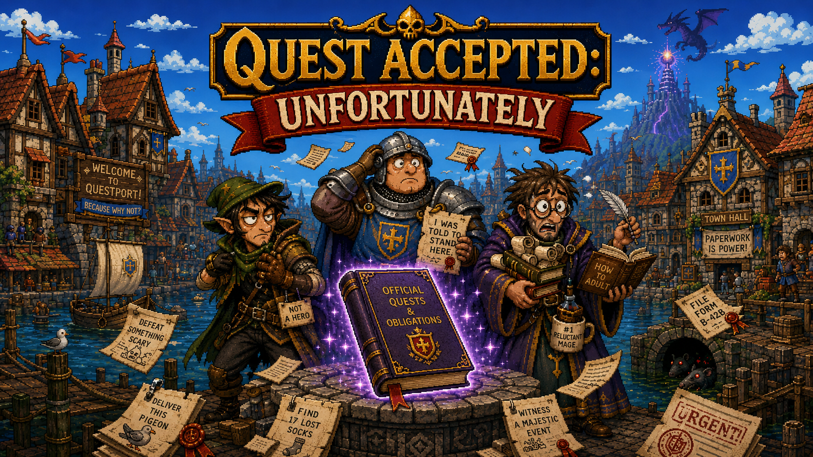
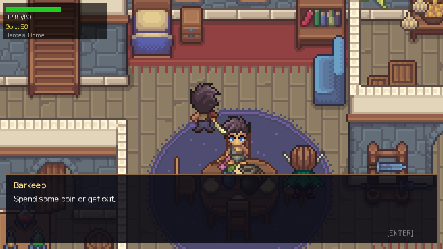
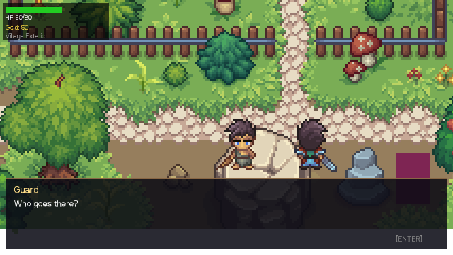
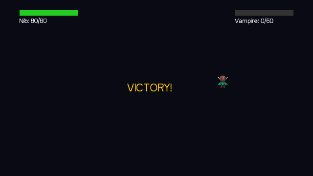
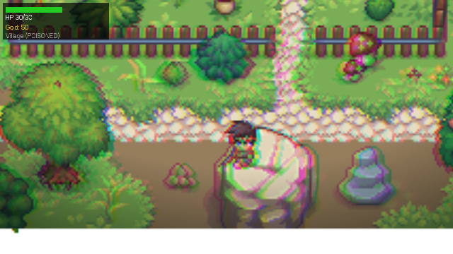
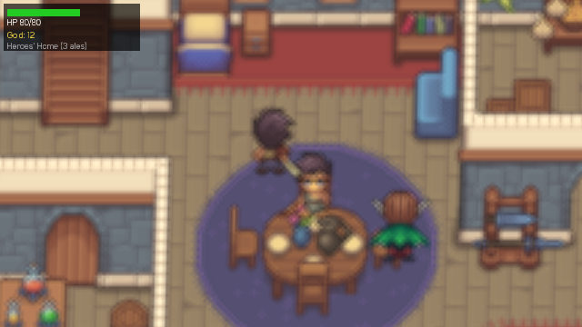
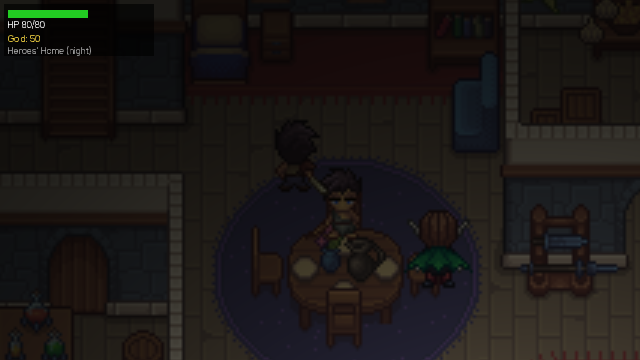

# GAIME — *Quest Accepted: Unfortunately*



**The Completely Official Quest of Questionable Importance**



*Genuine KorGE engine output, rendered headlessly via the offscreen GL screenshot
harness — not a mockup. See the [screenshot gallery](docs/screenshots/) for more.*

A dry, British-bureaucratic fantasy comedy RPG in an 8/16-bit SNES/Mega-Drive
top-down pixel style. Three misfit adventurers in the harbour town of
**Stokeport** are declared an official hero party by a **broken magical
Questbook** that interprets every spoken cliché, exaggeration, and throwaway
comment as a binding bureaucratic quest. You survive the consequences of your
own party's big mouths.

> *"Being a hero is mostly paperwork, and the paperwork is wrong."*

The comedy is never random. The system is always *understandably wrong*:
consistent, bureaucratic, and certain.

---

## The Core Mechanic: the Questbook

The **Questbook** is a magical artefact that listens to the party's spoken
**barks** and turns them into official quests. After a "municipal update" it can
no longer tell intent from irony, boasting, panic, or a tavern lie — so it no
longer *records* a story, it **enforces** one.

**Critical design distinction — there is no AI, NLP, or speech recognition:**

- A bark is an internal game event: a `BarkEvent` enum key.
- When a bark plays, the game already knows its key.
- The Questbook reacts to the **`BarkEvent` key**, never to audio.
- Every reaction is **deterministic**: same bark in same context → same result.

```
Nib: "I smell treasure!"   ->  BarkEvent.NIB_SMELL_TREASURE
                            ->  QuestbookProcessor (fixed bureaucratic misreading)
                            ->  "Official Request: locate and catalogue all
                                 olfactory-detectable valuables" + quest marker
                                 on the nearest pile of garbage
```

Every trigger is **map-local, cooldown-limited, failsafe-protected, and visibly
traceable**. See [`docs/GAME_CONCEPT_LOCK.md`](docs/GAME_CONCEPT_LOCK.md) and
[`docs/BARK_TRIGGER_TABLE.md`](docs/BARK_TRIGGER_TABLE.md).

### Quest Pressure

A single map-local meter with three levels. It rises on pressure/danger barks,
only affects the current map, and resets on map transition — it never causes
permanent world-state changes.

| Level | Effects |
|-------|---------|
| **LOW** | Harmless markers, small hints, flavour reactions |
| **MEDIUM** | Enemies spawn, traps activate, false quest markers appear |
| **HIGH** | Boss-level chaos, contained within the current map |

---

## The Party

| Character | Archetype | Barks tend to create… |
|-----------|-----------|------------------------|
| **Nib** | Quick, morally flexible rogue with a loot radar | greed- and escape-based misinterpretations |
| **Brugg** | Large, loyal, uncomplicated warrior | combat-obligation and duty-based misinterpretations |
| **Vellum** | Scholarly, condescending mage | knowledge-, elemental-, and contractual misinterpretations |

---

## Campaign

The canonical full game is **Prologue + 5 Chapters + Finale** (~60–90 min). The
**vertical slice** (Prologue + Chapter 1) proves the core pipeline; the campaign
is built chapter by chapter on top of it. Full canon lives in
[`docs/CAMPAIGN.md`](docs/CAMPAIGN.md).

| # | Chapter | Setting | Boss |
|---|---------|---------|------|
| 0 | The Four-Armed Bartender | Tavern *The Limping Cockatrice* | — |
| 1 | The Sewers of Bad Decisions | Sewers | The Rat Accountant |
| 2 | The Market of Mandatory Commerce | Stokeport market & guardhouse | The Guard Captain Who Cannot Legally Move |
| 3 | The Woods That Had Opinions | Forest | The Helpful Tree |
| 4 | The Ship That Was Technically Seaworthy | Harbour & ship | Captain Formbeard |
| 5 | The Dragon That Was Accidentally Summoned | Island | The Administragon |
| F | Done Enough | The broken Questbook | *System Overload* mechanic |

The **Finale "System Overload"** climax: at HIGH pressure with enough
contradictory quests, the Questbook overloads and imposes a `GAME OVER` upon
*itself*.

### Comedy & staging systems

- **Comedy Bible** ([`docs/COMEDY_BIBLE.md`](docs/COMEDY_BIBLE.md)) — the joke is
  *architecture, not a moral filter*: `sacred concept + banal administrative
  process + an over-serious Questbook`.
- **Insult Duel** — enum-based duel mini-system (no free text, no AI) using
  *OFFICIAL DIGNITY* instead of HP.
- **Dramatic Entrances** — scripted, renderer-agnostic boss reveals where the
  `ironyGap` (buildup vs. actual threat) is the joke; overhyped entrances are
  *enforced* to end on a deflating punchline.
- **Songbook** ([`docs/SONGBOOK.md`](docs/SONGBOOK.md)) — title theme + five boss
  themes, mapped per chapter.
- **End credits** — an absurdly long credits roll for a short game, with ~90
  ridiculous roles split between exactly two entities.

---

## Architecture

GAIME is a **Kotlin Multiplatform** project targeting **Desktop (JVM)** and
**Android**. The game logic is fully renderer-agnostic and lives in a pure
`:core` module so it can be unit-tested headlessly and rendered by any frontend.
The playable game is rendered by the **`:game` KorGE module**; `:composeApp` has
been reduced to a thin waitroom/menu shell (its old Compose-Canvas gameplay engine
was retired in the KorGE migration).

```
:core        Pure, engine-agnostic Kotlin game logic. No Compose, no renderer deps.
             - rpg.bark        BarkEvent / BarkRegistry / BarkEventBus / AmbientBarks
             - rpg.bark.audio  AudioPlayer interface + BarkAudioPlayer (engine-agnostic)
             - rpg.questbook   QuestbookProcessor, QuestPressure, RoomContext, reactions
             - rpg.combat      CombatEngine, boss controllers, EnemyArchetype, AttackStyle
             - rpg.tiled       own TMX tilemap loader + tile-derived CollisionGrid
             - rpg.world       grid world, camera, movement
             - rpg.duel        Insult Duel mini-system
             - rpg.staging     Dramatic entrances (DramaticEntrance / EntranceLibrary)
             - rpg.humor       SatiricalQuestbook
             - rpg.music       MusicTrack registry (songbook)
             - rpg.credits     end-credits data
             - rpg.i18n        Localizer (9 languages; text only, audio stays English)
             - rpg.finale      QuestbookOverload climax mechanic
             - rpg.SliceDirector   traceable spine: Bark → Questbook → effect, + combat
             - rpg.Chapter / rpg.SlicePhase, core.GameStateMachine, signals.*
             + all pure unit tests (commonTest)

:game        KorGE 6.0.0 frontend (depends on :core). The playable game.
             - WorldScene      TMX world: smooth movement, NPCs, dialog (E), camera follow
             - BattleScene     turn-based combat wired to :core CombatEngine + bark pipeline
             - CharacterSprite directional CraftPix sprite rows (DOWN/LEFT/UP/RIGHT)
             - TiledMapView    renders :core tilemaps (flip bits, animated tiles)
             - HudOverlay / DialogOverlay   screen-fixed HUD + dialog box
             - GameAudioPlayer KorGE AudioPlayer impl (music, SFX, bark voice lines)
             - shader.*        screen-space GLSL effects (poison, beer-goggle, lighting, rain, heat)
             - ScreenshotHarness   headless offscreen-GL render harness for CI screenshots
             Desktop (JVM 21) is primary; Android target compiles.

:composeApp  Interim Compose Multiplatform shell (depends on :core).
             - WaitroomScreen / GameCanvas   menu / waitroom only
             - rpg.bark.audio  PlatformAudioPlayer expect/actual
             - app.App         renders the waitroom; Android & Desktop entry points
             Treated as throwaway — removed once :game reaches full parity.
```

### Localization

All user-facing **text** is localized via `:core`'s `Localizer` into 9 languages
(EN, DE, ES, FR, IT, PT, RU, ZH, JA) with graceful English fallback. **Audio
(voice barks and songs) is never localized** — it stays English.

### Rendering engine direction

The playable frontend is **KorGE 6.0.0** (GPU-accelerated, HD-2D layered look,
still Kotlin Multiplatform), the locked long-term renderer. The staged migration
is essentially complete: `:core` extracted, the `:game` KorGE module built, the
TMX tilemap loader + tile-derived collision moved to `:core`, real CraftPix
sprites + battle + audio ported, the full world layer (movement, NPCs, dialog,
HUD, map transitions) implemented, and the old Compose-Canvas gameplay engine
**retired** (`:composeApp` is now waitroom-only). Recent work added directional
sprite rows, an audio-backed bark pipeline in `:game`, and screen-space GLSL
shader effects. See
[`.kiro/steering/rendering-engine.md`](.kiro/steering/rendering-engine.md) and
[`docs/KORGE_MIGRATION_PLAN.md`](docs/KORGE_MIGRATION_PLAN.md).

### Screenshots

All rendered headlessly through the offscreen-GL [`ScreenshotHarness`](game/src/desktopMain/kotlin/game/ScreenshotHarness.kt)
— genuine engine output, reproducible with `./gradlew :game:screenshot` (see
[`docs/screenshots/`](docs/screenshots/)).

| Tavern interior + dialog | Village exterior + dialog | Battle |
|---|---|---|
|  |  |  |

Screen-space shader effects (poison, beer-goggle, lighting, rain, heat shimmer):

| Poison | Beer goggle | Lighting |
|---|---|---|
|  |  |  |

---

## Build & Run

### Prerequisites

- JDK 17+ (JDK 25 works; `:core`/`:composeApp` compile to JVM 17 for Android).
  The `:game` KorGE module targets **JVM 21** (KorGE 6.0.0 ships JVM-21 bytecode)
  and needs a JDK 21+ to build — the bundled toolchain (JDK 21) satisfies this.
- Gradle wrapper is included (`./gradlew`); Android builds also need the Android SDK

### Common commands

```bash
# Run the pure logic + tests for the core module (fast, headless, no UI)
./gradlew :core:desktopTest

# Compile the KorGE game module (the playable frontend)
./gradlew :game:compileKotlinDesktop

# Run the KorGE game in a desktop window (needs a GL-capable display)
./gradlew :game:run

# Render the game headlessly to PNGs (no window; uses Mesa EGL software GL)
bash scripts/setup-gl.sh          # one-time: install the headless GL stack
./gradlew :game:screenshot        # writes build/screenshots/*.png

# Build everything
./gradlew build

# Run / build the interim Compose waitroom shell
./gradlew :composeApp:run
./gradlew :composeApp:assembleDebug   # debug Android APK (requires Android SDK)
```

> CI/headless environments can compile and unit-test `:core`, compile `:game`
> and `:composeApp`, and **render the game to PNGs via the offscreen-GL
> screenshot harness**. Opening an interactive GL window (`:game:run`) is
> manual/local.

---

## Documentation

| Doc | What it covers |
|-----|----------------|
| [`docs/GAME_CONCEPT_LOCK.md`](docs/GAME_CONCEPT_LOCK.md) | Locked core concept, party, Questbook rules, scope |
| [`docs/CAMPAIGN.md`](docs/CAMPAIGN.md) | Canonical full campaign: chapters, bosses, finale |
| [`docs/VERTICAL_SLICE.md`](docs/VERTICAL_SLICE.md) | The buildable Prologue + Chapter 1 proof |
| [`docs/BARK_TRIGGER_TABLE.md`](docs/BARK_TRIGGER_TABLE.md) | Bark → Questbook reaction trigger table |
| [`docs/COMEDY_BIBLE.md`](docs/COMEDY_BIBLE.md) | The humour design as canon |
| [`docs/SONGBOOK.md`](docs/SONGBOOK.md) | Soundtrack: title + boss themes and lyrics |
| [`docs/ASSET_PIPELINE.md`](docs/ASSET_PIPELINE.md) | Targeted art/audio asset upload list |

---

## Scope guardrails

To stay buildable and on-tone, the project deliberately does **not** include:
open-world simulation, real audio/speech recognition, branching dialogue trees,
AI-driven dialogue, procedural content, multiplayer, crafting or skill trees, or
any chapters/party members/mechanics beyond those defined in
[`docs/CAMPAIGN.md`](docs/CAMPAIGN.md). Build it small and prove each piece works.
