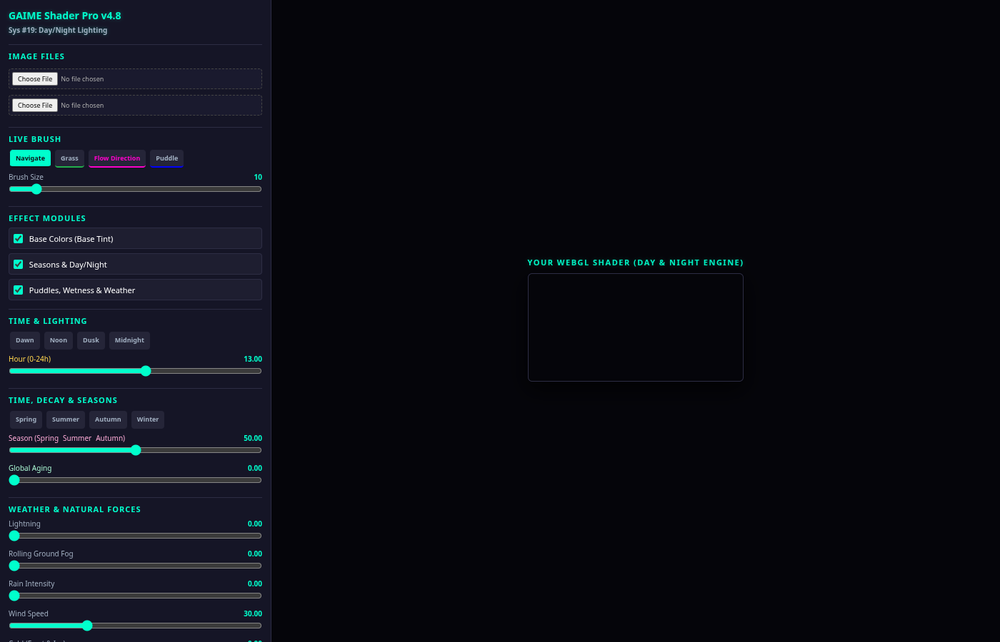
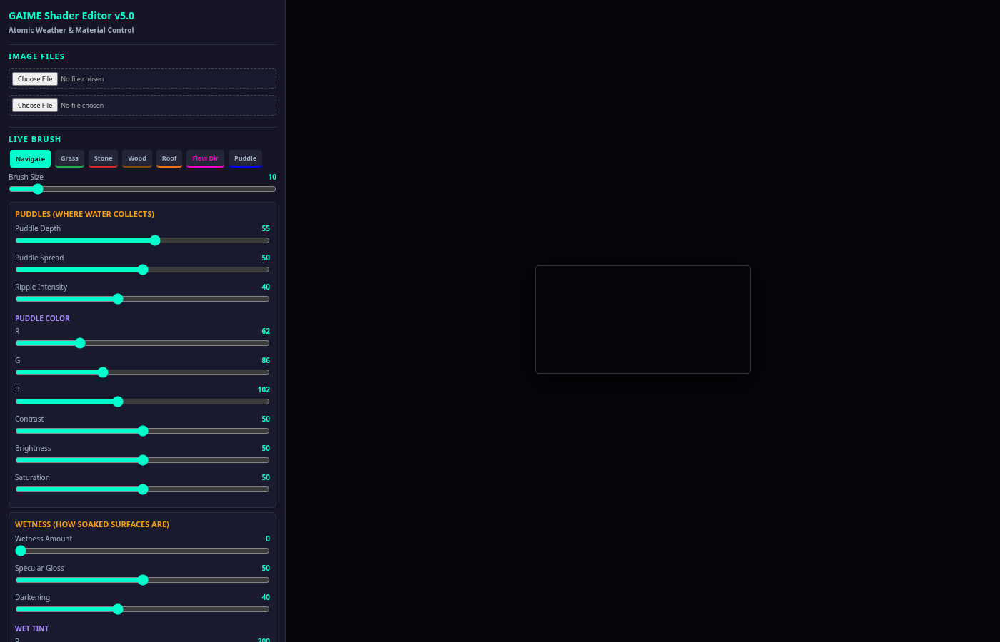

# GAIME Shader Editor — Visual Test Report
Generated: 2026-06-30T19:59:02.525Z

## Feature Comparison Matrix

| Feature | v4.7 (Codex) | v4.8 (Day/Night) | v5.0 (Atomic) |
|---------|:---:|:---:|:---:|
| Material classification | distance-based (step/nearest) | inverse-distance weighting (soft blend) | inverse-distance weighting + threshold |
| Weather control | single "weather" slider (0-100) | individual sliders (rain, wind, cold, lightning, fog) | atomic: 3 separate sections |
| Puddles | combined with weather slider | checkbox-enabled (shared with wetness) | INDEPENDENT section (depth, spread, ripple + RGB/con/bri/sat) |
| Wetness | combined with weather slider | checkbox-enabled (shared with puddles) | INDEPENDENT section (amount, gloss, darken + RGB/con/bri/sat) |
| Rain | combined with weather slider | separate slider | INDEPENDENT in Weather section |
| Time of day | NO | YES (0-24h continuous) | YES (independent axis, 0-24h) |
| Season | NO | YES (0-100 spring→autumn) | YES (independent axis, spring→winter) |
| Day/Night | NO | YES (via time of day) | YES (via time of day, independent from season) |
| Paint brush | NO | YES (grass + puddle + flow vector) | YES (grass/stone/wood/roof/puddle + flow vector) |
| Flow vectors | NO (uses material map angle) | YES (drag-to-paint direction) | YES (drag-to-paint direction) |
| Per-material grading | YES (RGB + contrast + brightness + opacity) | NO (auto from inverse-distance) | YES (6 materials × RGB + contrast + brightness + saturation) |
| Keyframes | YES (10-slot animation) | NO | NO (removed for simplicity) |
| Asset sets | YES (village + tavern presets) | NO (file inputs only) | NO (file inputs only) |
| Export PNG | YES | NO | YES |
| Export JSON | YES | NO | YES (+ localStorage restore) |

## Test Findings

- ℹ️ **[v4.7_codex]** Asset set buttons: present
- ✅ **[v4.7_codex]** All UI text in English
- ℹ️ **[v4.7_codex]** Canvas: 300x150 (exists: true)
- ✅ **[v4.7_codex]** No JS errors on load
- ✅ **[v4.8_tag_nacht]** All UI text in English
- ℹ️ **[v4.8_tag_nacht]** Brush tools: Navigate, Grass, Flow Direction, Puddle (4 total)
- ℹ️ **[v4.8_tag_nacht]** Canvas: 300x150 (exists: true)
- ✅ **[v4.8_tag_nacht]** No JS errors on load
- ✅ **[v5.0_weather_atomic]** All UI text in English
- ℹ️ **[v5.0_weather_atomic]** Brush tools: Navigate, Grass, Stone, Wood, Roof, Flow Dir, Puddle (7 total)
- ℹ️ **[v5.0_weather_atomic]** Canvas: 300x150 (exists: true)
- ✅ **[v5.0_weather_atomic]** No JS errors on load

## Screenshots

| Editor | UI Layout |
|--------|:---------:|
| v4.7_codex |  |
| v4.8_tag_nacht |  |
| v5.0_weather_atomic |  |

## Identified Bugs & Issues

### From Code Review (PRs #56-#66, now fixed)

| Priority | Bug | Status | Editor |
|----------|-----|--------|--------|
| CRITICAL | atan(0,0) → undefined behavior | ✅ FIXED | v4.7 |
| CRITICAL | mGr fires on non-material pixels | ✅ FIXED | v4.7 |
| CRITICAL | time float32 precision loss | ✅ FIXED | v4.7, v4.8 |
| CRITICAL | distance() uses unnecessary sqrt | ✅ FIXED | v4.7 |
| MEDIUM | URL.createObjectURL memory leak | ✅ FIXED | all |
| MEDIUM | localStorage without try-catch | ✅ FIXED | v4.7, v5.0 |
| MEDIUM | selectedSources never cleared | ✅ FIXED | v4.7 |
| MEDIUM | No onerror handler on Image | ✅ FIXED | all |
| LOW | German UI labels | ✅ FIXED | all |

### Remaining Known Issues

| Priority | Issue | Editor | Notes |
|----------|-------|--------|-------|
| LOW | No export buttons | v4.8 | Intentional (paint-focused editor) |
| LOW | No keyframe system | v4.8, v5.0 | v5.0 uses localStorage restore instead |
| MEDIUM | Asset presets use relative paths | v4.7 | Only works when served from repo root |
| LOW | No undo for paint strokes | v4.8, v5.0 | Would need canvas history stack |

## Architecture Comparison

### v4.7 (Codex)
- Single weather axis ("w" 0-100) drives everything
- Material classification: hard step() nearest-neighbor
- 5 texture slots (scene, target, mat, phys1, phys2)
- Keyframe interpolation for animation
- No painting, no time-of-day

### v4.8 (Tag/Nacht)
- Multiple weather axes (rain, wind, cold, lightning, fog)
- Material classification: soft inverse-distance weighting (8th power)
- 3 texture slots (scene, mat, flow)
- Live brush painting with vector flow topology
- Day/Night cycle + Seasons + Lightning
- Season and Time linked via presets (not fully independent)

### v5.0 (Atomic Weather)
- THREE independent weather sections: Puddles / Wetness / Weather
- Each with atomic RGB + Contrast + Brightness + Saturation
- Material classification: inverse-distance + threshold guard
- 3 texture slots (scene, mat, flow)
- Time of Day and Season as fully independent axes
- Live brush with 6 material colors + flow vector
- Per-material grading (6 materials × 6 params)
- localStorage state persistence
